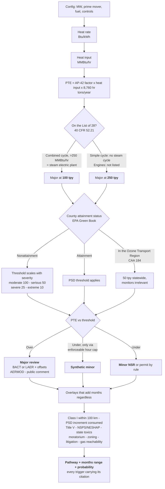
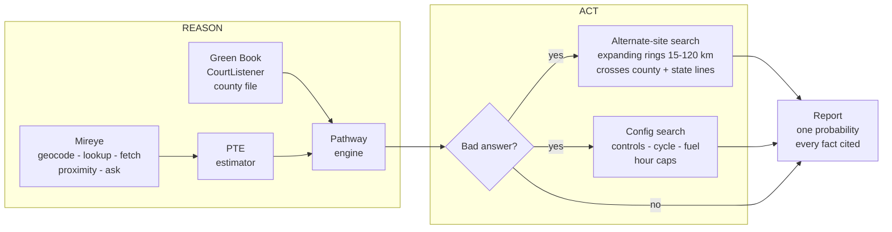

# Deliverable

**Announced ≠ deliverable.** An agent that works out which air permit a data center
power project needs at a specific parcel — and when the answer is bad, goes and finds
a parcel or a design where it isn't.

Built on [Mireye](https://www.mireye.com) for the physical layer.

---

## The one fact this is built on

> **Which permit you need is decided by where the land is, not by what you're building.**

Here is a real parcel in Ashburn, Virginia. Mireye says it is excellent: **120 m to a
230 kV transmission line, 504 m to a substation.** By any siting deck, it is a yes.

Then you ask the next question.

| | |
|---|---|
| County ozone status | **Nonattainment, Moderate** |
| Nearest Class I area | **Shenandoah NP, 63 km** — inside the 100 km Federal Land Manager radius |
| 500 MW combined cycle here | Major nonattainment NSR, **~57 months** |
| Same plant, Ellis County TX | Major PSD, **~20 months** |

Same machine. Same fuel. **37 months of difference, decided entirely by the dirt.**

Their API tells you the site is good. This tells you whether they'll let you switch
it on.

---

## The decision tree

This is the part people get wrong. It is not "big plant = hard permit." It is a
sequence of legal tests where a single design choice moves a threshold by 150 tons.



Three things in there that are worth knowing:

**Potential to emit is computed at 8,760 hours.** Telling the agency you only plan to
run 2,000 hours changes nothing. Only a *federally enforceable* permit condition does.
That is the entire synthetic-minor mechanism, and the code enforces it — `run_hours`
below 8,760 is ignored unless `enforceable_limit=True`.

**A combined-cycle plant is on the List of 28. A simple-cycle plant is not.** The HRSG
makes it a "fossil fuel-fired steam electric plant." Threshold drops 250 → 100 tpy on
that alone. Data centers themselves are not a listed category. The power plant on the
site is.

**Emissions scale with fuel burned, not megawatts.** Combined cycle runs ~6,800 Btu/kWh
against simple cycle's ~10,500. Same 500 MW, a third less fuel, a third less NOx —
before a single control device. That is why a *design change* can move a project across
a legal line without changing its size.

---

## What "agent" means here

The contest rule is: reason, decide, **act**. Not a website with a map on it.



The loop is a real Anthropic tool-calling loop over ten tools, not a chain of
`if` statements. **The model decides which Mireye calls to make; the engines decide
what is true.** No number in the output was written by the model in prose.

It picks calls adaptively. PTE is computed first because it is free arithmetic and it
tells you whether AERMOD is coming — which is what decides whether terrain is worth
buying. A fuel-cell config never buys receptor data. Any gas config always buys pipeline
distance. The trace records what it **declined** to fetch and why, because that is part
of the reasoning too.

---

## A real run

```console
$ python -m agent.planner "39.4862,-75.0257" --county Cumberland --state NJ

  Auth path: claude-agent-sdk · claude-opus-5 · 13 tool calls · 94 Mireye credits

  400 MW simple cycle, uncontrolled
  Heat input 4,200 MMBtu/hr → NOx 5,887 tpy

  Cumberland County, NJ — ozone nonattainment (serious), Philadelphia-Atlantic City
  New Jersey is in the Ozone Transport Region     → threshold 50 tpy, not 100
  NJ DEP may deny on environmental justice grounds → discretionary, not schedule
  CourtListener: MONTGOMERY v. DATAONE USA LLC, D.N.J., filed 2026-05-26

  → MAJOR NONATTAINMENT NSR
    41–104 months, likely 66.  7,064 tons of offsets at 1.20:1.
    2% probability of energizing on the announced 16-month schedule.

  ACT ─ alternate site
    New Castle County, DE — 37 miles W — 24 months saved
    clears: ej_denial_authority, state_toxics
    note: DE is in the same Ozone Transport Region. This escapes New Jersey's
          state stack, not the transport region. DE is not modelled in detail,
          so some of the gain may be that gap.

  ACT ─ config search
    Solid oxide fuel cells → MINOR NSR, 21.6 months. 44 months saved.
```

That last line is the one to sit with. The config search recommends going
non-combustion. **Nebius did exactly that at this site on 20 May 2026** — 328 MW of
Bloom fuel cells — 80 days after the date we froze the inputs at.

---

## The national result

Every US county scored on days-until-legal-power for one reference plant
(500 MW combined cycle, DLN + SCR + oxidation catalyst).

| | |
|---|---:|
| Counties scored | **3,222** |
| Major PSD | 2,843 |
| Major nonattainment NSR | 379 |
| **Minor** | **0** |
| Spread, identical equipment | **1,309 days** |

**There is no county in the United States where a 500 MW onsite gas plant is a minor
source.** At that size NOx clears 100 tpy everywhere. The question is never "can I
avoid major review" — it is "which flavour, and how many months."

All 21 New Jersey counties tie for slowest at 1,918 days, on the Ozone Transport
Region plus EJ-denial stack. Nobody hand-coded that. The engine derived it, and it is
the same mechanism that stopped Nebius.

Map: `outputs/county_map.html` — 708 KB, self-contained, zero external requests,
renders with JavaScript disabled.

---

## What we combined Mireye with

The judging criterion asks what sits next to their API. Their own first two examples:

| Source | What it answers | Result |
|---|---|---|
| **EPA Green Book** | Is this county nonattainment, for which pollutant, at what severity | 463 designations across 245 counties, parsed from EPA's dBASE files. 171 partial-county areas flagged rather than silently applied. |
| **CourtListener / RECAP** | Has this developer, county or facility been sued | Live. Pulls *NAACP v. X.AI Corp.*, 3:26-cv-00074, N.D. Miss. |

Everything physical comes from Mireye. We did not build EIA pipeline ingest, routing,
or a FERC queue scraper. `docs/mireye-api-notes.md` has the full engineering note,
including a credit cost model that reproduces their meter exactly — 884 modelled
against 884 billed.

---

## Setup

```bash
git clone https://github.com/akshatsingh-dev/deliverable
cd deliverable
python3 -m venv .venv && source .venv/bin/activate
pip install -r requirements.txt
python -m pytest -q                    # 52 tests, no API keys needed
```

Live:

```bash
cp .env.example .env
# MIREYE_API_KEY            mireye.com/account, code BUILD
# CLAUDE_CODE_OAUTH_TOKEN   run `claude setup-token` — uses a Claude subscription
#   (or ANTHROPIC_API_KEY)
# COURTLISTENER_TOKEN       free, courtlistener.com/profile/api-token/

python -m agent.planner "39.4862,-75.0257" --county Cumberland --state NJ
python -m sweep.counties --fresh && python -m sweep.map
python -m backtest.cases
```

The repo runs with **no keys at all**. `NullProvider` refuses every physical lookup
rather than returning plausible defaults, so a keyless run is obviously incomplete
rather than quietly wrong. The planner falls back to a deterministic no-LLM path that
calls the same functions in the same order, and labels itself as such in the trace.

---

## What's real and what isn't

Written before the rest, so it doesn't get softened.

- **Backtest is 3 cases and one is a miss.** Vineland NJ and Project Jupiter NM both
  hit on the mechanism that actually bound. xAI Colossus 1 is a miss — the engine says
  major PSD and ~2 years, and xAI energised in weeks by asserting the turbines were
  nonroad engines. **This tool prices the compliant path. It has no variable for a
  developer who runs it anyway and litigates.** Three cases is a demonstration, not an
  out-of-sample test. A real one needs a point-in-time panel across hundreds of
  projects, which is a multi-year data engineering problem.
- **8 states modelled in detail** (VA TX GA OH AZ NJ NM IL). The other 42 get federal
  defaults and the output says so rather than hiding it. The statutory Ozone Transport
  Region is applied to all 12 OTR states regardless, because a search that recommended
  "move from NJ to PA" without it was selling a saving that does not exist.
- **27 counties hand-entered** for moratoria and zoning posture. Deliberately not a
  scraper. Every record carries its source URL.
- **The county map is a screening layer.** County-level facts only. It cannot see
  parcel increment, terrain, or pipeline distance. The parcel run is the answer.
- **Timelines are calibrated on public permit records and agency guidance**, not a
  validated statistical model. They are ranges, presented as ranges.
- **This is a screen, not an applicability determination.** A licensed professional
  signs that and carries the liability. We are the engine underneath, sold to them.
- **Incumbents exist.** Sightline Climate, Data Center Watch, BNEF and JLL sell
  pipeline intelligence. They *track*. They do not compute the pathway and they do not
  search for a better parcel. That is the wedge, and it is a narrow one.

Every factual claim in this repo is checked source-by-source in **`docs/evidence.md`** —
13 confirmed, 5 reworded, 1 removed as unsupported. Including one we got backwards
ourselves and fixed: the January 2026 EPA turbine rule did **not** close the nonroad
loophole. It finalised a *conditional exclusion* that is not operative, because EPA
hasn't done the Title II rulemaking it depends on. The trailer-mounted fast path is
unsettled, not closed — with a federal injunction hearing this month.

---

## Layout

```
agent/
  emissions.py   PTE estimator — AP-42 factors, heat-rate based, pure math
  pathway.py     the decision engine — List of 28, NSR, overlays, timelines
  planner.py     the tool-calling loop — 3 auth paths incl. a keyless fallback
  search.py      alternate-site + config search — this is the "act"
  tools.py       10 tool schemas, shared across model backends
  report.py      terminal / markdown / JSON, with a provenance appendix
providers/
  base.py        PhysicalFactsProvider — makes going international a data problem
  mireye.py      the US implementation, with a verified credit cost model
  cache.py       SQLite response cache, so re-runs are free
ingest/
  greenbook.py   EPA nonattainment, parsed from dBASE
  dockets.py     CourtListener
  counties.json  27 hand-verified county records
sweep/           3,222-county scoring + the self-contained map
backtest/        Vineland NJ, Project Jupiter NM, xAI Memphis
docs/            evidence ledger, API notes, plain-English explainer, glossary
```

`BUILD-LOG.md` explains the whole thing end to end, including every correction made
along the way.
