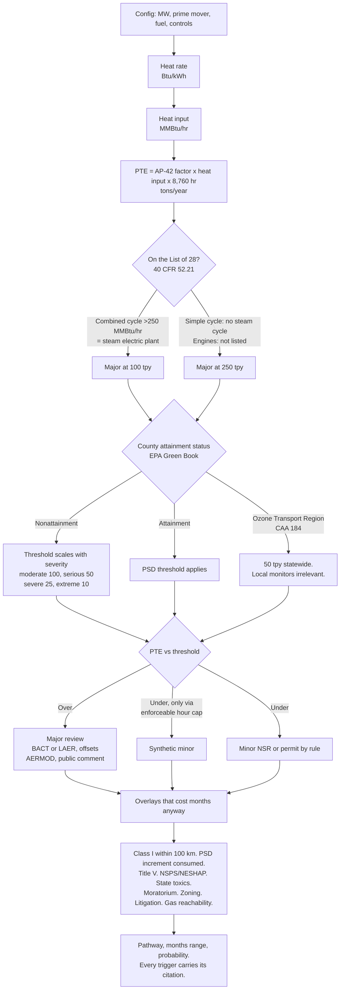

# Groundtruth

Works out which air permit a data center power project needs at a specific parcel.
When the answer is bad, it goes and finds a parcel or a plant design where it isn't.

Announced ≠ deliverable.

Built on [Mireye](https://www.mireye.com) for the physical layer.

---

## The thing nobody prices

Which permit you need is decided by where the land is. Not by what you're building.

Take a real parcel in Ashburn, Virginia. Mireye says it's excellent. 120 m to a
230 kV line, 504 m to a substation. Every siting metric says yes.

Now ask the next question.

| | |
|---|---|
| County ozone status | Nonattainment, Moderate |
| Nearest Class I area | Shenandoah NP, 63 km. Inside the 100 km FLM radius. |
| 500 MW combined cycle here | Major nonattainment NSR, likely 54 months |
| Same plant, Anderson County TX | Major PSD, likely 20 months |

Same machine. Same fuel. 34 months apart, decided by the dirt.

Developers buy for power, fiber and price. They find this out at month nine.

---

## The problem, properly

The chips exist. The money exists. The power doesn't.

Morgan Stanley puts US data center need at another **68 GW between 2026 and 2028**.
15 GW is under construction, another 15 GW is covered by available or contracted grid
capacity. That's a **38 GW hole** before mitigations. Their base case still leaves 1 to
11 GW short through 2028 even after gas turbines and miner conversions.

Everyone announces anyway. **16 GW announced for 2026, closer to 5 GW actually on the
ground**, once you account for permitting, grid constraints, transformer lead times
running five years, and turbine order books full into 2030. Of ~140 tracked projects
slated to finish in 2026, only ~5 GW was actively under construction. Sightline expects
30 to 50% of that pipeline to slip.

Then it gets blocked. Q1 2026 alone: **75 projects worth roughly $130 billion blocked or
delayed**, matching the entire prior year in a single quarter. Active opposition groups
went from 396 at the end of 2025 to **833 across 49 states**.

Routing around the grid hits the same wall. Of ~90 GW of announced behind-the-meter
generation across 59 projects, **2.2% is operating** and about 60% is still only an
announcement. New Mexico's Land Commissioner denied the right-of-way for the pipeline
feeding Project Jupiter, twice. Virginia DEQ has approved **exactly one** air permit for
a data center campus with onsite gas.

Nebius is the case worth getting right, because the ending is the interesting part. 36
Bergen gas engines, 403 MW, Vineland NJ, under a $17.4B Microsoft deal. The NJDEP
application stalled. It was never denied. On **20 May 2026 they abandoned combustion
entirely** and switched to 328 MW of Bloom fuel cells. Groundtruth's config search, run
on inputs frozen at 1 March 2026, recommends exactly that swap.

Every number here is checked source by source in `docs/evidence.md`. 13 confirmed,
5 reworded, 1 deleted as unsupported.

### Musk said the quiet part on Dwarkesh

Published 5 February 2026. Verbatim:

> "They have to do a study for a year. A year later, they'll come back to you with their
> interconnect study."

> "The utility industry is a very slow industry. They pretty much impedance match to the
> government, to the Public Utility Commissions."

> "I think it's pretty hard to cover Nevada in solar panels. You have to get permits. Try
> getting the permits for that. See what happens."

Dwarkesh's own summary: you can't plug into the utilities because the interconnect queues
are too long, you can't go behind the meter because turbine lead times stretch past 2030,
and you can't do solar because of permits and tariffs.

His answer was to leave the planet. This one is to find the ground that says yes.

---

## The decision tree

It isn't "big plant, hard permit." It's a sequence of legal tests, and one design
choice moves a threshold by 150 tons.



**Potential to emit is computed at 8,760 hours.** Saying you'll only run 2,000 doesn't
matter. Only a federally enforceable permit condition lowers it. That's what synthetic
minor *is*. The code enforces it: `run_hours` below 8,760 gets ignored unless
`enforceable_limit=True`. There's a test on it, because getting that backwards tells a
developer they're minor when the agency will call them major.

**Combined cycle is on the List of 28. Simple cycle isn't.** The HRSG makes it a
"fossil fuel-fired steam electric plant of more than 250 million Btu per hour." So the
threshold drops from 250 tpy to 100. Data centers aren't a listed category. The power
plant on the site is.

**Emissions track fuel burned, not megawatts.** Combined cycle runs ~6,800 Btu/kWh.
Simple cycle ~10,500. Same 500 MW, a third less fuel, a third less NOx, before you
install anything. Which is how a design change moves a project across a legal line
without changing its size.

One more, since it bit us in testing. On a 15 MW turbine with DLN and SCR fitted, the
binding pollutant isn't NOx. It's **CO at 57 tpy**, because neither control touches CO.
Screen on NOx alone and you miss it. An oxidation catalyst drops it under 10.

---

## What "agent" means here

Contest rule: reason, decide, act. Not a website with a map on it.


Real tool-calling loop over ten tools. Not a chain of `if` statements. The model picks
which Mireye calls to make. The engines decide what's true. Nothing in the output is a
number the model wrote in prose.

It plans adaptively. PTE gets computed first because it's free arithmetic and it tells
you whether AERMOD is coming, which is what decides whether terrain is worth buying.
Fuel cell config? Never buys receptor data. Any gas config? Always buys pipeline
distance. The trace logs what it **declined** to fetch and why. A screen that can't
justify what it skipped isn't a screen.

Three auth paths, resolved at startup: Claude Agent SDK via OAuth token, Anthropic
Messages API via key, or a deterministic no-LLM fallback that walks the same functions
in the same order. Same trace shape on all three. The repo stays runnable with zero keys.

---

## A real run

```console
$ python -m agent.planner "39.4862,-75.0257" --county Cumberland --state NJ

  Auth path: claude-agent-sdk · claude-opus-5 · 13 tool calls · 94 Mireye credits

  400 MW simple cycle, uncontrolled
  Heat input 4,200 MMBtu/hr -> NOx 5,887 tpy

  Cumberland County, NJ. Ozone nonattainment (serious), Philadelphia-Atlantic City.
  New Jersey sits in the Ozone Transport Region     -> threshold 50 tpy, not 100
  NJ DEP can deny on environmental justice grounds  -> discretionary, not schedule
  CourtListener: MONTGOMERY v. DATAONE USA LLC, D.N.J., filed 2026-05-26

  -> MAJOR NONATTAINMENT NSR
     41-104 months, likely 66.  7,064 tons of offsets at 1.20:1.
     2% probability of energizing on the announced 16-month schedule.

  ACT / alternate site
     New Castle County, DE. 37 miles W. 24 months saved.
     clears: ej_denial_authority, state_toxics
     note: DE is in the same Ozone Transport Region. This escapes New Jersey's
           state stack, not the OTR. DE isn't modelled in detail, so some of
           the gain may be that gap.

  ACT / config search
     Solid oxide fuel cells -> MINOR NSR, 21.6 months. 44 months saved.
```

That last line. The config search says go non-combustion. Nebius did exactly that at
this site on 20 May 2026, 328 MW of Bloom fuel cells, 80 days after the date we froze
the inputs at.

---

## Every county in the country

One reference plant, 500 MW combined cycle with DLN, SCR and an oxidation catalyst,
scored against all 3,222 counties and county equivalents.

| | |
|---|---:|
| Major PSD | 2,843 |
| Major nonattainment NSR | 379 |
| Minor | **0** |
| Spread, identical equipment | **1,309 days** |

There is no county in the United States where a 500 MW onsite gas plant is a minor
source. NOx clears 100 tpy everywhere. The question is never whether you avoid major
review. It's which flavour and how many months.

All 21 New Jersey counties tie for slowest at 1,918 days on the OTR plus EJ-denial
stack. Nobody hand-coded that. The engine derived it, and it's the same mechanism that
stopped Nebius.

`outputs/county_map.html`. 708 KB, self-contained, zero external requests, renders with
JavaScript off.

---

## What Mireye is combined with

Mireye is the physical layer and it does all of it. Parcel, terrain, land cover,
transmission, substation, gas pipeline, receptors, hazards, interconnection queue. No EIA
ingest, no routing layer, no FERC scraper. `docs/mireye-api-notes.md` is the engineering
note, including a credit cost model that reproduces their meter exactly. 884 modelled
against 884 billed.

Four sources sit next to it. Three are from the contest's own list of examples.

### Permit databases → EPA Green Book

Whether a county is in nonattainment, for which pollutant, at what severity. **463
designations across 245 counties**, parsed straight out of EPA's `nayro.dbf` and
`areadata.dbf`. EPA publishes dBASE and BIFF, no CSV, and dBASE III is 60 lines of
`struct.unpack`, so there's no GIS stack in this repo. 171 partial-county areas are
flagged rather than silently applied countywide.

**What it changes:** everything. Attainment means PSD at 100 or 250 tpy. Nonattainment
means NSR at a threshold that scales with severity, down to 10 tpy in an extreme area,
plus LAER with no cost defense, plus offsets you have to buy from an existing source at
up to 1.5:1. In a severe area those credits are often unavailable at any price, which is
a hard stop rather than a delay. One field flips a project between two different worlds.

### Court filings → CourtListener / RECAP

Federal dockets by developer and by county. Live, not cached fixtures. Pulls
*National Association for the Advancement of Colored People v. X.AI Corp.*,
3:26-cv-00074, N.D. Miss., filed 14 April 2026, cause 42:7413(b) Clean Air Act.

**What it changes:** it found *Montgomery v. DataOne USA LLC*, D.N.J., filed 26 May 2026,
against the developer at our own demo parcel. Litigation adds months and signals a
county that fights. It also caught a factual error in our own source material: the xAI
suit is over Colossus 2 in Southaven, Mississippi, not Memphis.

### Plus one that isn't on their list

**A hand-entered county posture file.** 27 counties with moratoria, zoning stance and
board voting history, entered by hand from primary sources. Not a scraper. Faster and
more accurate at this scale, every record carries a source URL, and a county moratorium
is a hard stop that no permit pathway routes around.

### In progress

Three more are being wired in. This section gets updated with results when they land, not
before.

- **Satellite imagery, Sentinel-2.** Is there a hole in the ground yet. Compares the
  announced groundbreaking date against observable clearing on the parcel. 60% of
  announced behind-the-meter generation exists only as an announcement, and this is how
  you tell which 60%. Validating against xAI Memphis as a positive control, because that
  one did get built and any method that can't see it is broken.
- **Spot GPU pricing.** Converts a permit delay into foregone compute revenue, which is
  the unit a fund actually underwrites in.
- **Local news signal.** Opposition shows up in a county newspaper months before it shows
  up in a permit denial. Being reconciled against the 27 hand-entered records to see
  whether it reproduces postures that were verified by hand.

---

## Where this goes next: India

The thesis is not American. It's what happens anywhere capital arrives faster than
permitting capacity, and India is the clearest second case.

Axis Capital says India's announced targets of **6 to 8 GW by 2030 look inflated**, and
puts the realistic figure at **3.4 to 3.6 GW** operational by mid-2030, with a downside
case around 2.8 GW. Operational stock today is about **1.8 GW of IT load** (Savills, H1
2026, up 36.6% year on year). **More than 10.5 GW sits in land banking**, which is the
Indian phrasing for announced and not broken ground.

The constraints rhyme but they aren't identical. Gensets from the three global brands
that matter, Caterpillar, Cummins and MTU, are booked out two years, and they're diesel,
which carries a different emissions and siting problem than gas. Power connections run
about 18 months. An operator on the record: *"The 28-36 month timeline is the real story
here. In Singapore or parts of the US you can get a facility up in 12-18 months. We're
doing vertical builds because land is expensive and permits are a nightmare."*

Same gap. Different regulator, different fuel, different failure mode.

**Why the code is already shaped for it.** `providers/base.py` defines a
`PhysicalFactsProvider` interface and `providers/mireye.py` is the US implementation of
it. The agent, the emissions estimator and the pathway engine never import Mireye. That
cost about twenty lines and it means going international is a data problem, not a rewrite.
The permit logic itself is jurisdiction-specific and would need rebuilding for CPCB and
the state pollution control boards, but the shape holds: resolve a parcel, read the
ground, estimate emissions, work out which consent you need, search for better ground.

**What's missing is the substrate.** There's no Mireye for India, and no equivalent. The
request for one is drafted at `outputs/drafts/mireye-region-request.md`.

## Setup

```bash
git clone https://github.com/akshatsingh-dev/deliverable
cd deliverable
python3 -m venv .venv && source .venv/bin/activate
pip install -r requirements.txt
python -m pytest -q                    # 52 tests, no keys needed
```

Live:

```bash
cp .env.example .env
# MIREYE_API_KEY            mireye.com/account, code BUILD
# CLAUDE_CODE_OAUTH_TOKEN   `claude setup-token`, or ANTHROPIC_API_KEY
# COURTLISTENER_TOKEN       free, courtlistener.com/profile/api-token/

python -m agent.planner "39.4862,-75.0257" --county Cumberland --state NJ
python -m sweep.counties --fresh && python -m sweep.map
python -m backtest.cases
```

`NullProvider` refuses every physical lookup rather than returning plausible defaults,
so a keyless run comes out obviously incomplete instead of quietly wrong.

---

## What's real and what isn't

Wrote this section first, before I could talk myself out of any of it.

**Backtest is 3 cases and one is a miss.** Vineland NJ and Project Jupiter NM both hit
on the mechanism that actually bound. xAI Colossus 1 is a miss. The engine says major
PSD, ~2 years. xAI energised in weeks by asserting the turbines were nonroad engines.
This tool prices the compliant path. It has no variable for a developer who runs it
anyway and litigates. Three cases is a demonstration. A real backtest needs a
point-in-time panel across hundreds of projects, which is a multi-year data engineering
problem and the usual reason alt-data startups die.

**8 states modelled in detail.** VA, TX, GA, OH, AZ, NJ, NM, IL. The other 42 get
federal defaults and the output says so. The Ozone Transport Region is applied to all
12 OTR states regardless, because without it the search happily recommended "move from
NJ to PA" and booked a saving that doesn't exist. Both states are in the OTR.

**27 counties hand-entered** for moratoria and zoning posture. Not a scraper. Every
record carries a source URL you can click.

**The county map is a screening layer.** County-level facts only. It can't see parcel
increment, terrain or pipeline distance. The parcel run is the answer.

**Timelines come from public permit records and agency guidance**, not a fitted model.
They're ranges and they're presented as ranges.

**This is a screen, not an applicability determination.** A licensed professional signs
those and carries the liability. We're the engine underneath, sold to the people who
sign.

**Incumbents exist.** Sightline Climate, Data Center Watch, BNEF, JLL all sell pipeline
intelligence. They track. They don't compute the pathway and they don't search for a
better parcel. Narrow wedge, but it's a real one.

Every factual claim in this repo got checked source by source in `docs/evidence.md`.
13 confirmed, 5 reworded, 1 deleted as unsupported. Including one I had backwards: the
January 2026 EPA turbine rule did **not** close the nonroad-engine loophole. It
finalised a conditional exclusion that isn't operative, because EPA hasn't done the
Title II rulemaking it depends on. The trailer-mounted path is unsettled, not closed,
with a federal injunction hearing this month. Most coverage of that rule has it
backwards too.

---

## Layout

```
agent/
  emissions.py   PTE estimator. AP-42 factors, heat-rate based, pure math.
  pathway.py     decision engine. List of 28, NSR, overlays, timelines.
  planner.py     the tool-calling loop. 3 auth paths, one keyless.
  search.py      alternate-site + config search. This is the "act".
  tools.py       10 tool schemas, shared across backends.
  report.py      terminal / markdown / JSON, with a provenance appendix.
providers/
  base.py        PhysicalFactsProvider. Going international is a data problem.
  mireye.py      US implementation, with a verified credit cost model.
  cache.py       SQLite response cache, so re-runs are free.
ingest/
  greenbook.py   EPA nonattainment, out of dBASE.
  dockets.py     CourtListener.
  counties.json  27 hand-verified county records.
sweep/           3,222-county scoring and the map.
backtest/        Vineland NJ, Project Jupiter NM, xAI Memphis.
docs/            evidence ledger, API notes, plain-English explainer, glossary.
```

`BUILD-LOG.md` walks the whole thing end to end, including everything that turned out
to be wrong along the way.

---

## Local UI

```bash
.venv/bin/python -m uvicorn ui.server:app --port 8000
```

A browser front end for driving the agent by hand. It is a client over the agent that
already exists — it calls `Planner.run`, streams the trace, renders the assessment. No
logic moved into it and nothing in `agent/` was restructured to serve it. The agent is the
submission; this is a window onto it.

The run is a POST that returns Server-Sent Events, so every trace step appears as it
happens rather than after a spinner: the model stating its plan, each tool call with its
payload, each result, then source category, threshold, attainment status, increment,
overlays. Steps carry what they billed and cache hits are marked `0 cr`. The alternate-site
search is held behind its own button with the candidate count and worst-case credit cost
shown before it fires, and a refused geocode renders as a stated decision rather than an
error. `outputs/demo/*.json` replays through the same page with no model and no credits.

`ui/README.md` has the rest.
